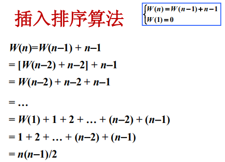
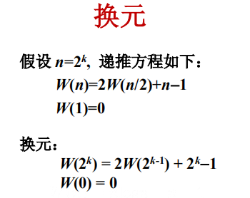
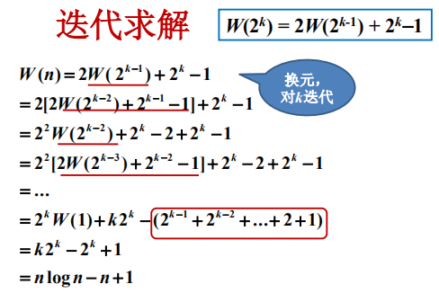

## 迭代法求解递推方程

#### 迭代法

1. 不断用递推方程的右部替换左部；
2. 每次替换，随着n的降低在和式中多出一项；
3. 直到出现初值停止迭代；
4. 将初值代入并对和式求和；
5. 可用数学归纳法验证解的正确性。

#### 例1：hanoi塔算法


#### 例2：插入排序算法



#### 换元迭代

1. 将对n的递推式换成对其它变元k的递推式；
2. 对k直接迭代;
3. 将解转换成关于n的函数。

#### 例3：二分归并排序

**伪码：**

```java
MergeSort(A,p,r)
input：数组A[p...r]
output：非递减排序的数组A
if p< r
	then q <- [(p+r)/2]//下取整
		MergeSort(A,p,q)
   		MergeSort(A,q+1,r)
    	Merge(A,p,q,r)
```

从上可推出时间复杂度公式为：

&emsp;&emsp;W(n) = 2W(n/2)+n-1，这里的(n-1)表示对排序后的两个子部分进行合并所需的时间。如果直接按照之前的直接迭代方式，会发现式子会变得比较复杂，不好求解，因此使用换元迭代法。






#### 用归纳法验证解的正确性

证明：下述递推方程的解释W(n) = n(n-1)/2

```java
已知：W(n) = W(n-1) + n-1，W(1)=0

证：
	当n=1时，W(1) = 1x(1-1)/2 = 0
    假设对于n，解满足方程，则
    W(n+1) = W(n)+n = n(n-1)/2 + n
    	   = n(n+1)/2
    证毕.
```

### 小结

1. 直接迭代，代入初值，然后求和；
2. 对递推方程和初值进行换元，然后求和，求和后进行相反换元，得到原始递推方程的解；
3. 用数学归纳法验证解的正确性