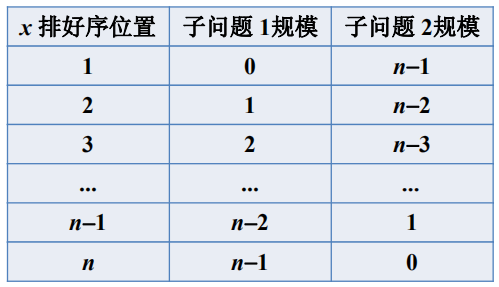
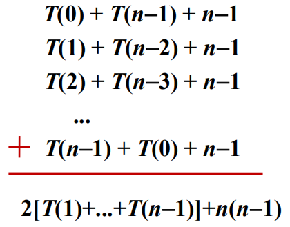
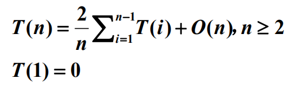
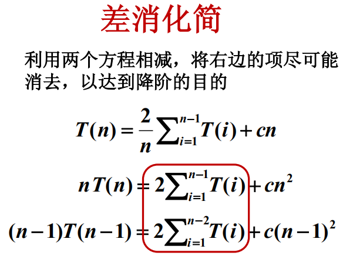
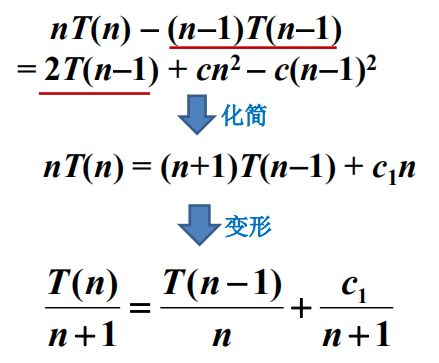
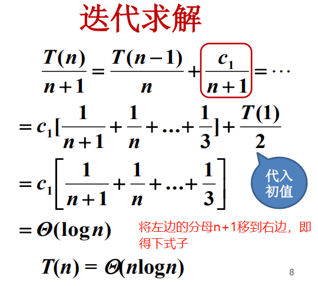

## 差消法化简高阶递推方程

#### 快速排序

```java
假设A[p...r]的元素彼此不等
以首元素A[1]对数组A[p...r]划分，令x=A[q],使得：
	小于x的元素放在A[p...q-1]
	大于x的元素放在A[q+1...r]
	递归对A[p...q-1]和A[q+1...r]排序
```

**工作量：**子问题工作量+划分工作量

#### 输入情况

有n中可能的输入：



对每个输入，划分的比较次数都是n-1.

#### 工作量总和

存在n中情况的工作量，累加再除以n得到平均情况下的工作量。



#### 快速排序的平均工作量

假设首元素排好序在每个位置是等概率的，则上式可以写成如下：



注意如果直接进行迭代，则每次都会产生出n个T(i)，求解难度复杂，所以先将次高阶方程化简，然后迭代。

#### 差消化简





上式中，**第一项刚好是第二项的后一项**，所以可以直接进行迭代求解了。



#### 总结

1. 对于高阶递推方程先要用差消法化简为一阶方程；
2. 迭代求解。