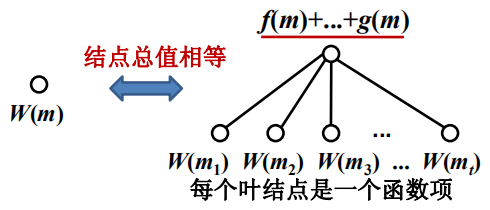
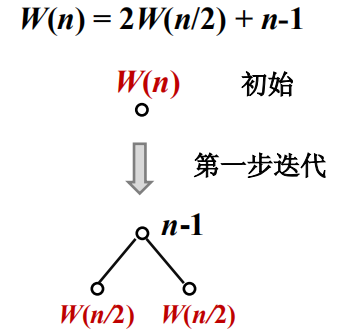
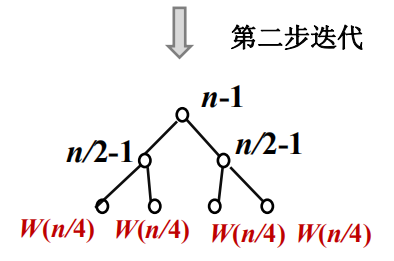
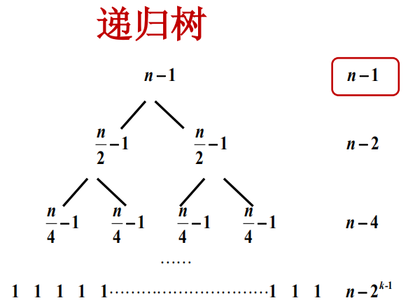
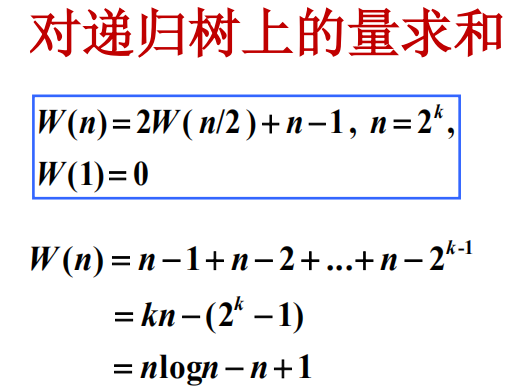
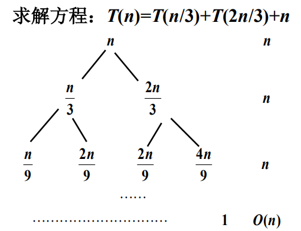
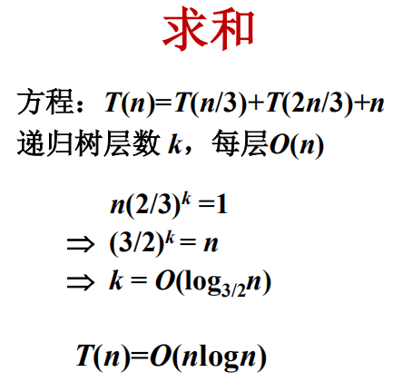

## 5.递归树

#### 基本概念

1. 递归树是迭代计算的图形化表示；
2. 递归树的生成过程与迭代过程一致；
3. 递归树上的所有项恰好是迭代之后产生和式中的项；
4. 对递归树上的项求和就是迭代后方程的解。

#### 迭代在递归树中的表示

如果递归树上某节点标记为W(m)，

W(m) = W(m1) + ... + W(mt)  

&emsp;&emsp; &ensp;+ f(m) + ... + g(m)，m1,...,mt < m

其中**W(m1),...,W(mt)**称为函数项，表示递归计算相应子问题的工作量。**f(m) + ... + g(m)**表示的工作量包括两部分：即用于将原问题划分为子问题的工作量，加上，子问题解决后，把这些子问题的解综合起来得到原问题解的工作量。

一个问题W(m)，可以表示为如图所示的树结构，替换后的所有节点的和与替换前的所有节点的和相等。

#### 二层子树的例子

其后面的加项为什么是：n+1 ？

#### 递归树的生成规则

1. 初始，递归树只有根节点，其值为W(n)；
2. 不断继续此过程：将函数项叶节点的迭代式W(m)表示成二层子树，用该子树替换该叶节点；
3. 继续递归树的生成，直到树种无函数项（只有初值）为止。

#### 递归树实例1：均匀划分

#### 递归实例2：非均匀划分

如上图所示，左子树问题的规模是根节点的1/3，右子树是2/3，所以说左子树会更早到达初值T(1)，因此当右子树问题还在迭代的时候，左子树已经迭代完了，因此有的层的工作量是小于n的，如上每层都计为n，是估计的问题的上界。

先求树的高度k，因为右子树的规模大于左子树，迭代得更长，所以取右子树来计算树的高。然后每层都是O(n)，相乘得上式。

#### 小结

1. 递归树是迭代的图形表述；
2. 递归树的生成规则，是用右部表达成一个二层的子树来不断的替换左部；
3. 如何利用递归树求解递推方程。