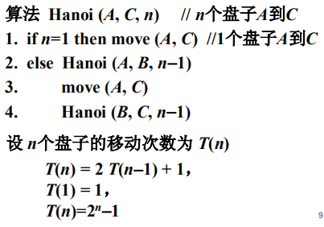

#### 分治策略的基本思想

**分治策略（Divide and Conquer）**

1. 将原始问题划分或者归结为规模较小的子问题；
2. 递归或迭代求解每个子问题；
3. 将子问题的解综合得到原问题的解。

**注意：**

1. 子问题与原始问题性质完全一样；
2. 子问题之间可彼此独立地求解；
3. 递归停止时子问题可直接求解。

#### 例题1：二分检索

下面是二分检索的迭代实现：

**设计思想：**

1. 通过x与中位数的比较，将原问题归结为规模减半的子问题，如果x小于中位数，则子问题由小于x的数构成，否则子问题由大于x的数构成；
2. 对子问题进行二分检索；
3. 当子问题规模为1时，直接比较x与T[m]，若相等则返回m，否则返回0.

**时间复杂度分析：**

可用换元迭代法求解W(n).

#### 例题2：二分归并排序

**设计思想：**

1. 划分将原问题归结为规模为n/2的2个子问题；
2. 继续划分，将原问题归结为规模为n/4的4个子问题，继续...，当子问题规模为1时，划分结束；
3. 从规模1到n/2，陆续归并被排好序的两个子数组，每归并一次，数组规模扩大一倍，直到原始数组。

**时间复杂度分析：**

可用换元迭代法求解W(n).

#### 例题3：Hanoi塔的递归算法

可直接用迭代法求解T(n).

**设计思想：**

1. 将原问题归结为规模为n-1的2个子问题；
2. 继续归约，将原问题归结为规模为n-2的4个子问题，继续...，当子问题规模为1时，归约过程截止；
3. 从规模1到n-1，陆续组合两个子问题的解，直到规模为n.

#### 小结

1. 子问题规模足够小时可直接求解；
2. 算法可以递归也可以迭代实现；
3. 算法的分析方法：递推方程。

