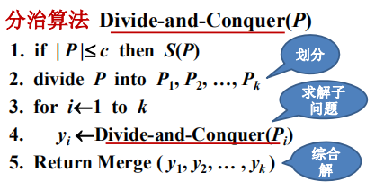
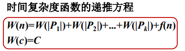
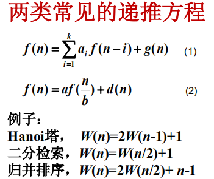
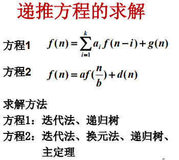
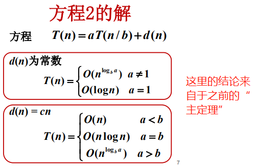

## 2.分治算法的一般描述和分析方法

#### 分治算法的一般性描述

**注：**当问题规模 P <= c 时，用S(P)算法求解子问题。

#### 设计要点

1. ##### 原问题可以划分或者归约为规模较小的子问题；

   子问题与原问题具有相同的性质；

   子问题的求解彼此独立；

   划分时子问题的规模尽可能均衡。

2. ##### 子问题规模足够小时可直接求解；

3. 子问题的解综合得到原问题的解；

4. 算法实现：递归或迭代。

#### 时间复杂度分析

**注：**

1. P1，P2，...，Pk为划分后产生的子问题；
2. f(n)为划分子问题以及将子问题的解综合得到原问题解的总工作量；
3. 规模为c的最小子问题的工作量为C。

#### 小结

1. **分治算法的一般描述**

   划分或归约为彼此独立的子问题；

   分别求解每个子问题；

   给出递归或迭代计算的终止条件；

   如何由子问题的解得到原问题的解。

2. **分治算法的分析方法**

   求解时间复杂度的递推方程；

   常用的递推方程的解。

