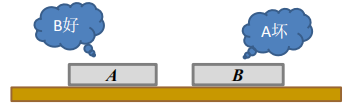
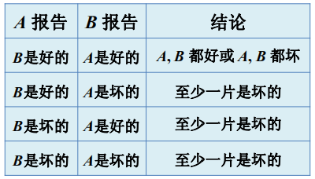
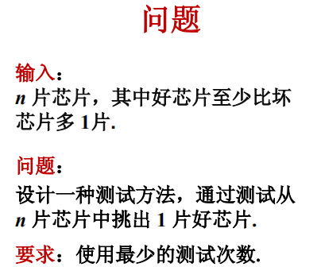
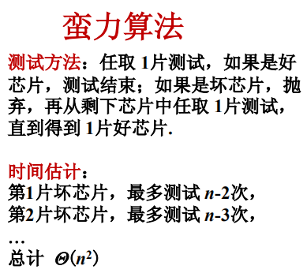
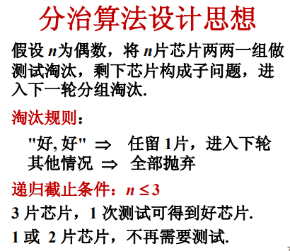
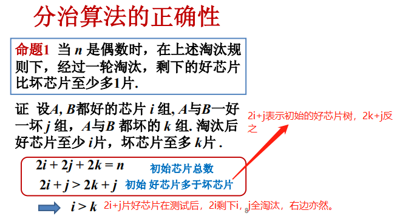
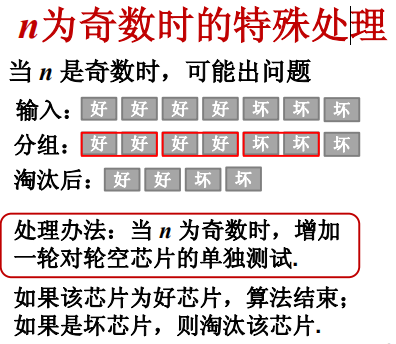
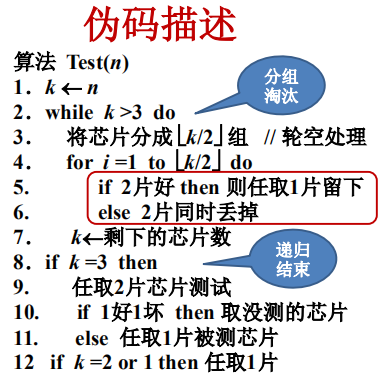
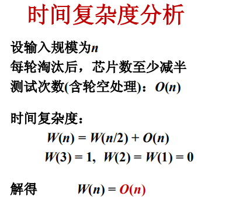

## 3.芯片测试

#### 一次测试过程

将2片芯片（A和B）置于测试台上，互相进行测试，测试报告是“好”或“坏”，只取其一。

注意：好芯片的报告一定正确，怀芯片的报告不确定。

#### 测试结果分析

#### 思路：判定芯片的好坏

对于给定的芯片A，判定A的好坏，则用其它n-1片芯片对A测试，对n是奇数还是偶数要分情况讨论。

**1. n为奇数时**

如，n=7：好芯片数>=4，则，

> A好，6个报告中至少3个报“好”，
>
> A坏，6个报告中至少4个报“坏”

则n是奇数：好芯片数 >= (n+1)/2，

A好，至少有 (n-1)/2 个报“好”，

A坏，至少有(n+1)/2个报“坏”

**2. n为偶数时**

如，n=8：好芯片数>=5，则

> A好，7个报告中至少有4个报"好"，
>
> A坏，7个报告中至少有5个报“坏”

n是偶数时：好芯片数 >= n/2 + 1，

A好，至少有n/2个报“好”，

A坏，至少有 n/2 + 1 个报告“坏”

**结论：**n-1份报告中

至少一半报“好”，则A为好芯片，

超过一半报“坏”，则A为坏芯片。

#### 解法一

如上的时间估计的“最多测试n-2”次指的是，用剩余的n-2片对选出的芯片进行测试时，测试结果出现“好坏好坏...”这样交替出现的情况，所以需要全部测试完才能判断出A的好坏。

#### 解法二

注意，递归的终止条件是子问题的规模<=3.

那上面的分治算法的子问题是否仍然满足原问题的特性呢？

#### 小结

1. 芯片测试的分治算法

   如何保证子问题与原问题性质相同：增加额外处理，

   额外处理的工作量不改变函数的阶，时间复杂度为O(n).

