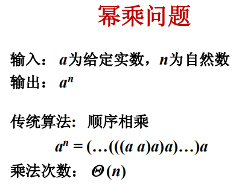
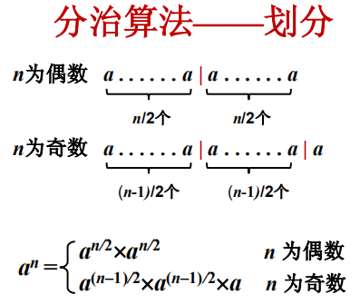
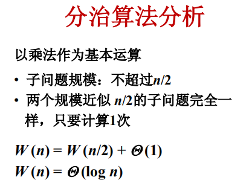
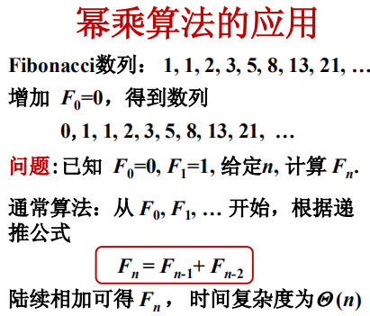
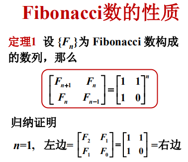
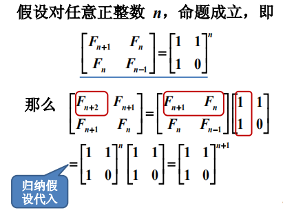
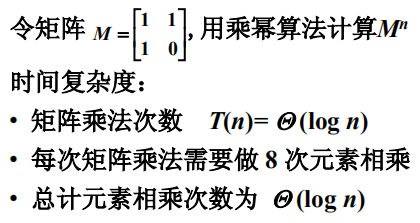

## 5.幂乘算法及其应用

[TOC]

### 幂乘问题的概念





代码如下：

```java
class Solution {
    public double myPow(double x, int n) {
        if(n==0)
            return 1;
        if(n<0){ //若n<0时，则求x的倒数的n次方
            n = -n;
            x = 1/x;
        }
        return fastPow(x,n);
    }
    
    public double fastPow(double x,int n){
        if(n==0)
            return 1;
        double ret = fastPow(x,n/2);
        if(n%2==0)
            return ret*ret;
        else
            return ret*ret*x;
    }
}
```



θ(1) 表示，在子问题求解了之后，再自己乘以自己，所需要的O(1)时间复杂度。

### 幂乘算法的应用







所以，可以用幂乘法来求解Fibonacci数列的Fn项。

具体实现代码如下：

​	未完~~

**算法分析**



### 小结

1. 分治算法的例子--幂乘算法；
2. 幂乘算法的应用：计算Fibonacci数；
3. 通常用分治算法的效率为O(logn)