## 一般选择问题的算法设计

###  问题：选第k小。

**input：**数组S，S的长度n，正整数k，1<= k <=n.

**output：**第 k 小的数。

> Example 1:
>
> S = {3,4,8,2,5,9,18}，k=5，解：5

> Example 2：
>
> 找S集合的中位数，|S| = n，解：即是第k=[n/2]（向下取整）小的数。


### 简单的算法

**算法一：**调用k此选最小算法(如一次冒泡)，时间复杂度为O(kn).

**算法二：**先排序，然后输出第k小的数，时间复杂度为O(nlogn)

**算法三：**建立大小为k的大顶堆，当所有元素都处理完之后，堆顶元素即为第k小的元素。时间复杂度为O(nlogk).


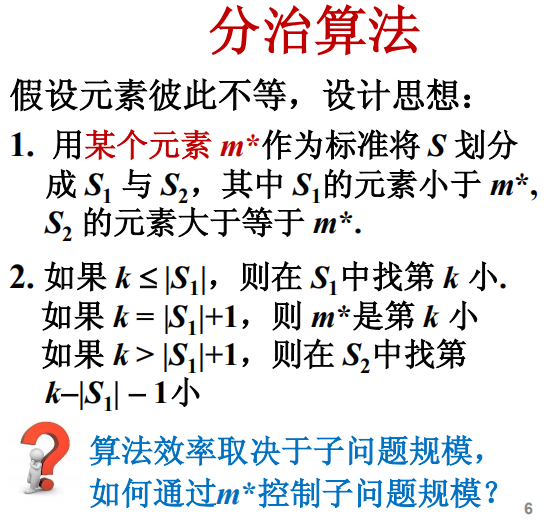

示例代码如下：

```java
借助快速排序中的Partition操作来进行划分操作。

```

时间复杂度为O(k) ？好像不是。。。


在屈老师的讲解中，不是简单的用partition进行划分，而是先把n个元素分成5个元素一组（为什么是5个元素，后面解释），共有[n/5]个组（上取整）。再对这些组根据每个组的中位数（下图中的M行即为所有的中位数）进行排列，比m*小的组放在它的左边，大的放在它的右边。

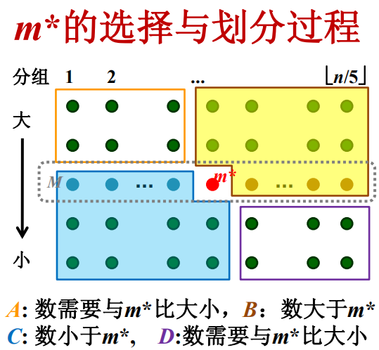

注意每列（小组）都会进行组内排序，所以每列的元素是从大到小排列的。同时又根据m*进行了排列，所以n个元素会分成如上所示的ABCD四个部分。

A和D区域的元素还需要继续和m*进行对比，根据比较结果将其划分到B和C区域。所以在下一轮的迭代中就直接进入B或C区域即可。

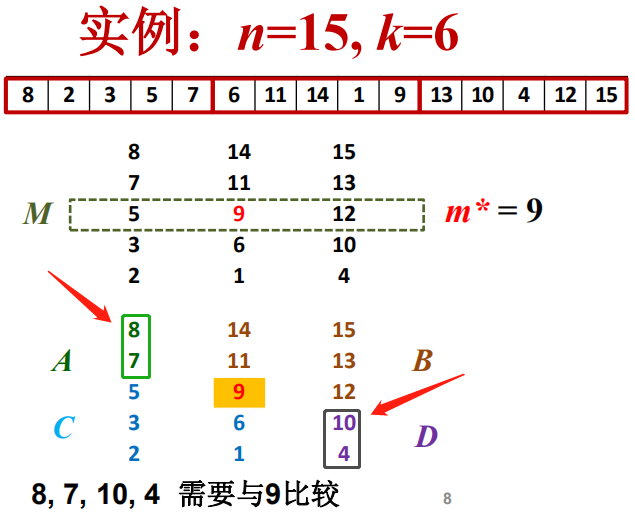

根据比较结果将这些数划入B或C区域，并根据参数k进行子问题的处理。

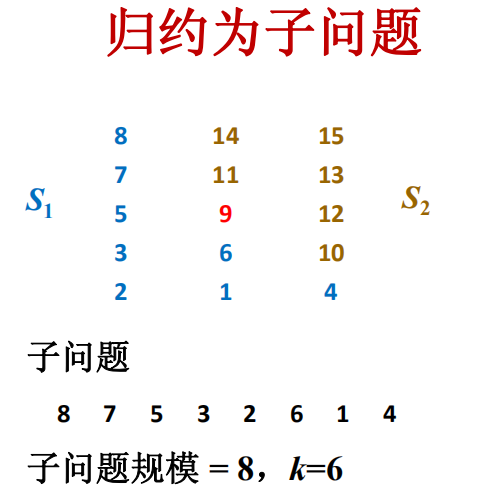


### 伪代码

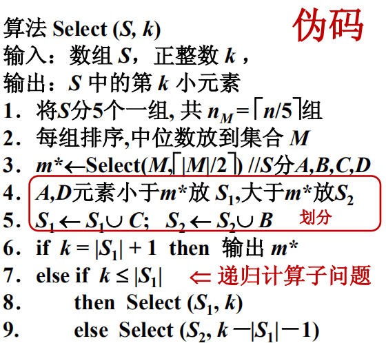

### 小结：选第k小的算法

分治策略：确定m* -> 用m*划分数组归约为子问题 -> 递归实现

## 算法分析

对于上述问题，由伪码可知，算法的复杂度取决于第3行计算中位数和对第8或9行子问题的计算量。

### 下面来讨论下子问题复杂度的上界。

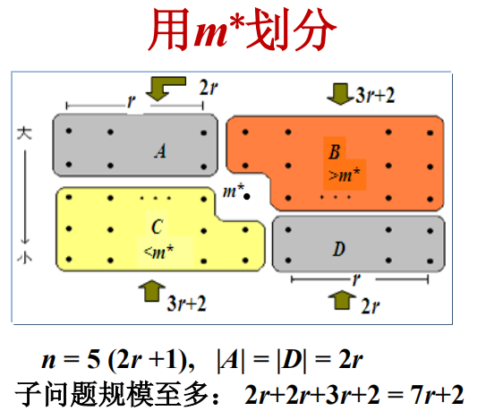

设总数为n，因为m*是中位数，所以根据它划分出了左右两部分，设左、右两部分各有 r 列，所以一共是有 2r+1列。元素个数n与r的关系为：n = 5(2r + 1)

**而子问题最大规模：2r + 2r + 3r +2 = 7r + 2**

（指左上和右下等与m*大小关系不明的元素全部都在左下或者右上部分）。

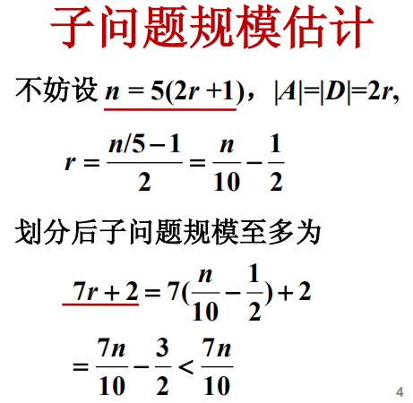

### 计算复杂度

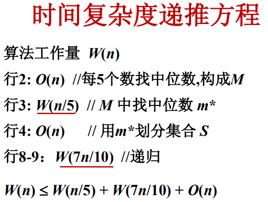

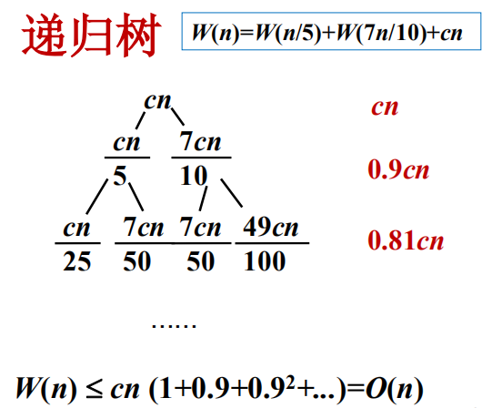


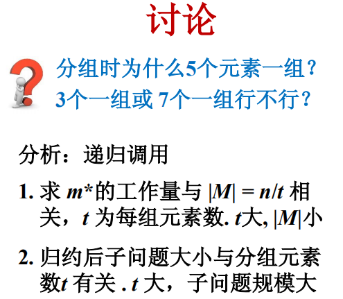


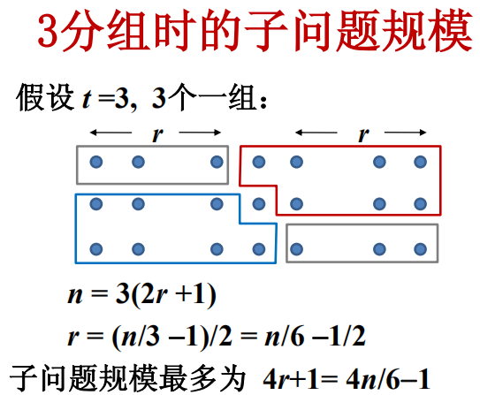


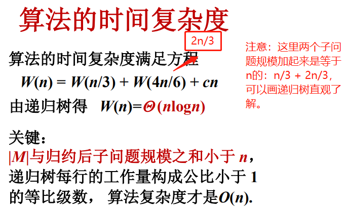


**为什么不进行和快速选择算法一样“选一个pivot元素，然后把整个数组分成左右两部分”的原因是？** 

答：这是因为在快速选择算法中所选择的pivot是随机的，在极端情况下，可能会出现子问题极其不均匀的情况，即pivot一端没有元素，而另一端包含n-1个元素。而使用如上分组的方法可使得子问题不会出现这种情况，最坏性能见如上分析。

### 小结

1. 通过递推方程求解算法的时间复杂度；
2. 分组时每组元素数的多少对时间复杂度的影响。